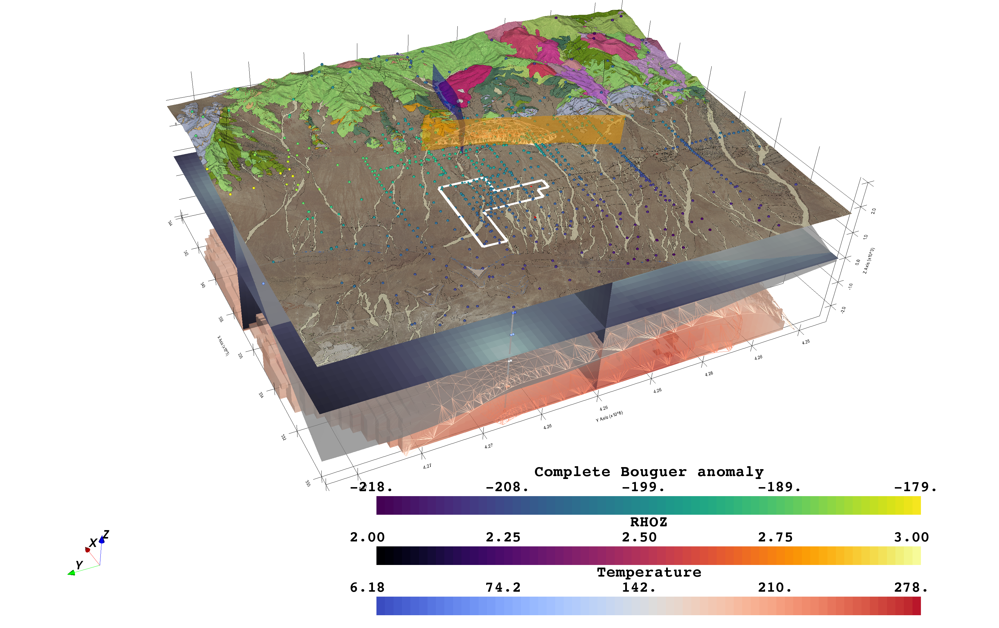

# Geothermal Design Challenge 2019

[](https://travis-ci.org/OpenGeoVis/GeothermalDesignChallenge)

This repository hosts all the code for [Bane Sullivan](https://github.com/banesullivan)
and [Adam Kinard](https://github.com/akinard96)'s work on the
[2019 Utah FORGE Geothermal Design Challenge](https://utahforge.com/studentcomp/).




## Getting Started

Be sure to regularly keep up with the project dependencies defined in the
`requirements.txt` file as development of `PVGeo`, `pyvista`, and `omfvista` will be
prioritized for this project:

```bash
conda install -c conda-forge gdal
conda install -c conda-forge dask
conda install verde geopandas numpy matplotlib jupyter scikit-learn
```

```bash
pip install -r requirements.txt
```


## Resources

- [Competition details](https://utahforge.com/studentcomp/?utm_source=Hubspot%20intro%20email010719&utm_source=hs_automation&utm_campaign=INL%20GDC%2019&utm_medium=email&utm_content=68794775&_hsenc=p2ANqtz--LMrr-vFzFD78-VnPLfeSy2tBImWRaDKacFvVBB19ebQ_Ry9Sm0hUEzE1GbNz0iRLniFjYKGNcFFJ_8V9_kxtKabsoMQ&_hsmi=68794775)

## Notes:

- LIVE webinar on January 25.


## Spatial Reference:

- UTM, zone 12N, NAD 83, NAVD 88.
