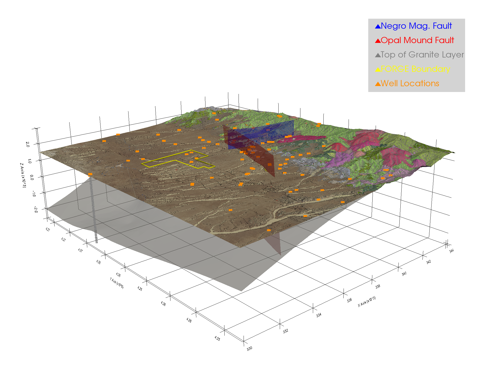
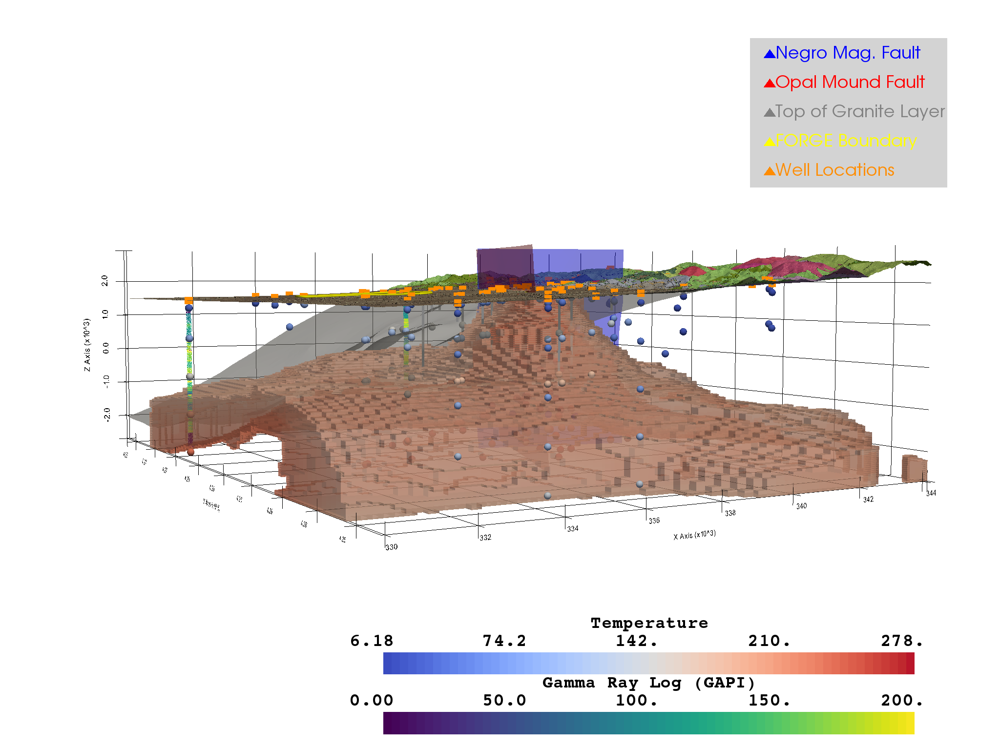
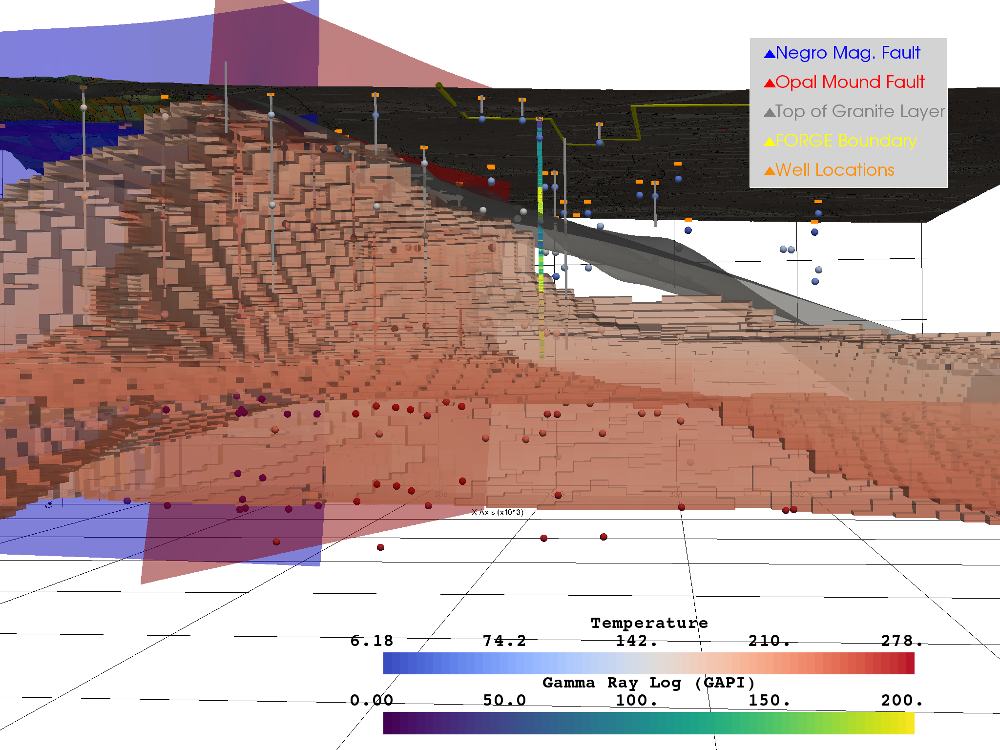
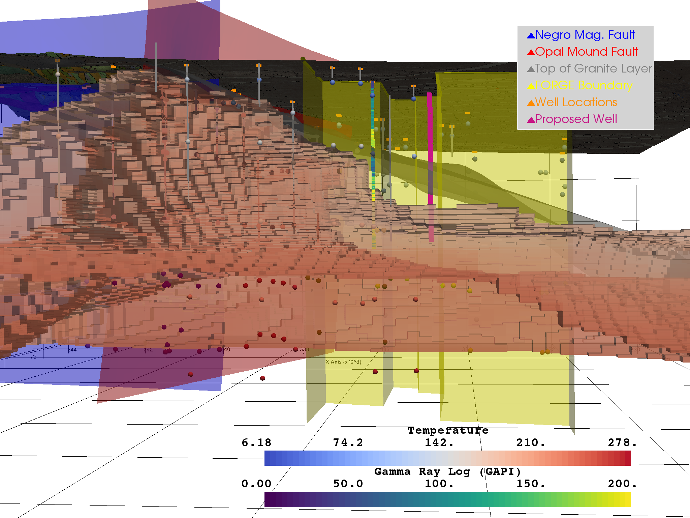
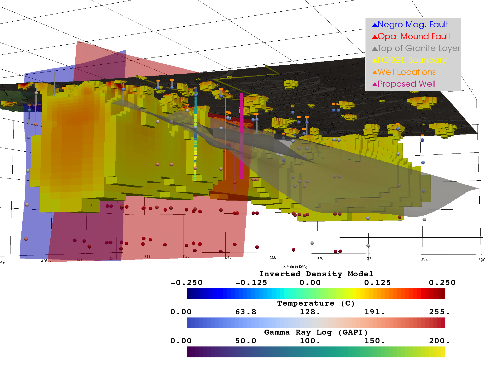
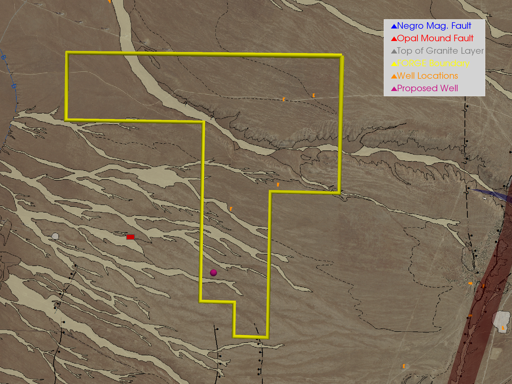

Static Portfolio
================

Figure 1
--------

FORGE Site Regional Overview

Figure 2
--------

Regional subsurface view showing temperature model threshold between 175ºC and 225ºC paired with Gamma Ray Well Logs.

Figure 3
--------

Regional subsurface view cropped at the northern boundary of the FORGE site.

Figure 4
--------

Regional subsurface view of the FORGE site with an added location, depth, and trajectory of our proposed production well.

Figure 5
--------

Subsurface view of the FORGE site with an added gravity model to show regional subsurface density trends

Figure 6
--------

FORGE site overview with location of proposed production well.

