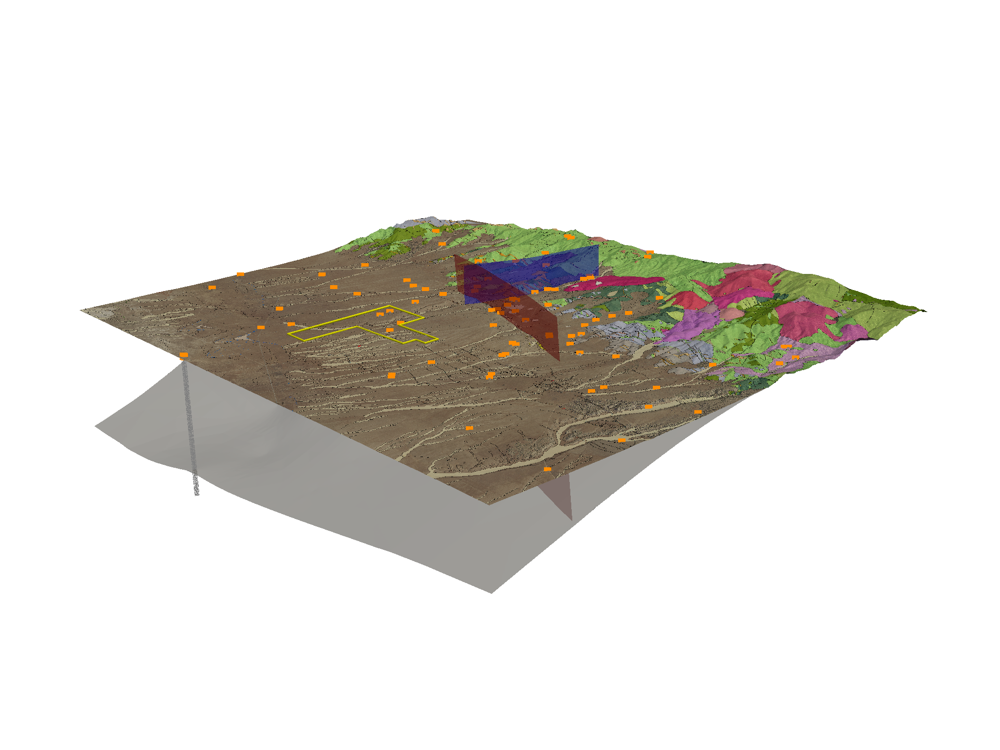
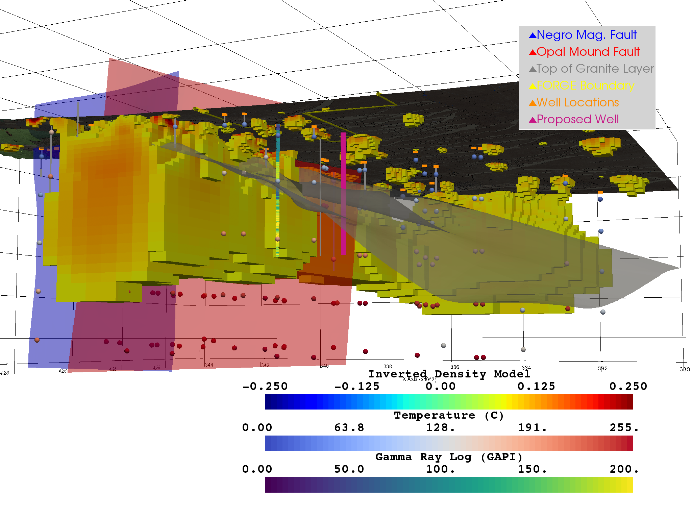

Static Portfolio
================

Figure 1
--------

FORGE Site Regional Overview

Figure 2
--------

Regional subsurface view showing temperature model threshold between 175ºC and 225ºC paired with Gamma Ray Well Logs.

.. figure:: ../images/figure-02.png
   :alt: Figure 2
   :target: http://forge-2.pvgeo.org

Figure 3
--------

Regional subsurface view cropped at the northern boundary of the FORGE site.

.. figure:: ../images/figure-03.png
   :alt: Figure 3
   :target: http://forge-3.pvgeo.org

Figure 4
--------

Regional subsurface view of the FORGE site with an added location, depth, and trajectory of our proposed production well.

.. figure:: ../images/figure-04.png
   :alt: Figure 4
   :target: http://forge-4.pvgeo.org

Figure 5
--------

Subsurface view of the FORGE site with an added gravity model to show regional subsurface density trends

Figure 6
--------

FORGE site overview with location of proposed production well.

