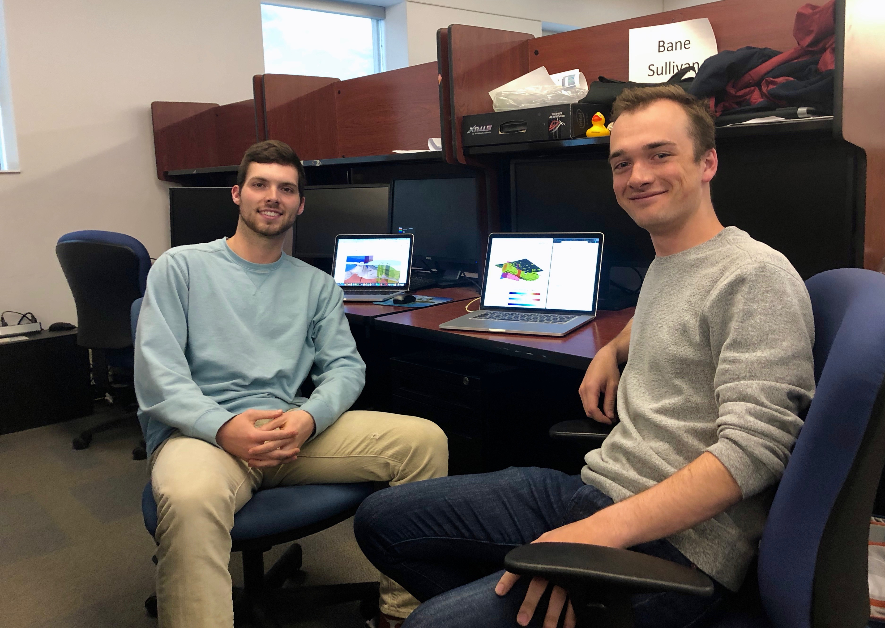

.. _meet_the_team:

Meet the Team
=============

   Meet the team: Adam Kinard (left) & Bane Sullivan (right)

Bane Sullivan
-------------

Bane, project lead, previously graduated from the Colorado School of Mines with
a B.S. in Geophysical Engineering and currently is continuing his education in
the Hydrological Science and Engineering graduate program at CSM focusing on
Hydrogeophysics.
In his career, Bane is interested in integrating characterizations of water
resources as a critical tool for resource managers in securing a freshwater
future.

Notably, Bane is the lead developer for many of the open-source tools used in
this project. Learn more about Bane on `his website`_.

.. _his website: http://banesullivan.com

Adam Kinard
-----------

Adam is a student at the Colorado School of Mines from Dallas, TX.
He will be graduating with a B.S. in Geophysical Engineering in May 2019 and
a M.S. in Computer Science in December 2019.
In his career, Adam is interested in the application of machine-learning and
data analytics to investigate potential subsurface reservoirs and maximize
production. Later in his career, Adam is interested in collaborating on an
open-sourced, worldwide subsurface platform to better understand the true
amount of natural resources remaining on this Earth, especially for the aid
of those less fortunate.

Learn more about Adam on `his LinkedIn profile`_.

.. _his LinkedIn profile: https://www.linkedin.com/in/adamkinard
